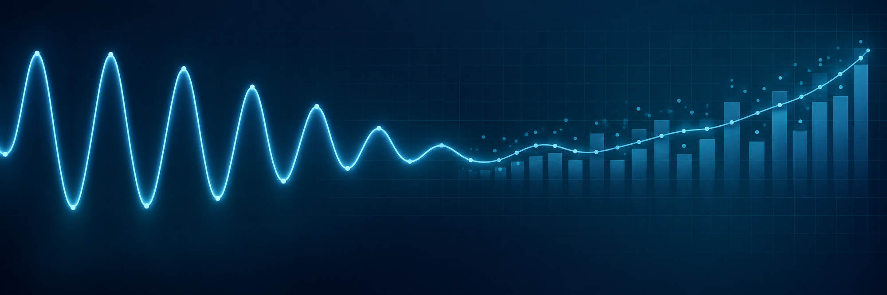
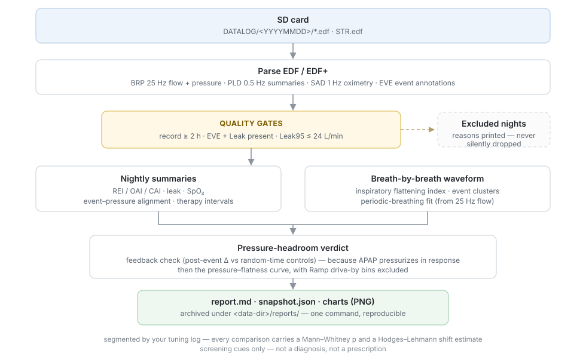
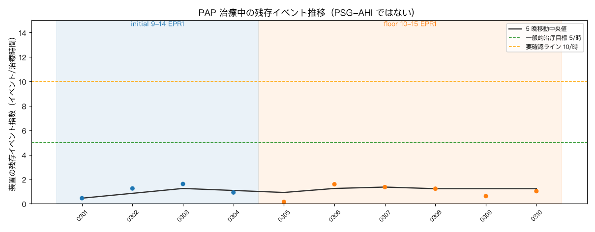
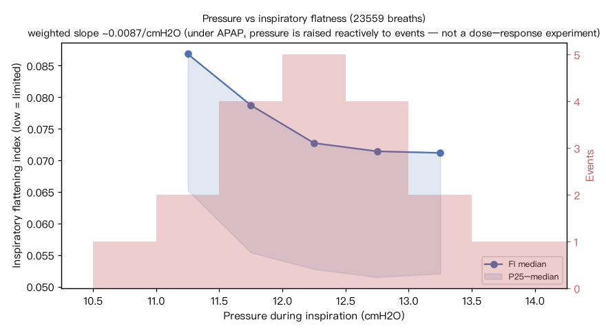
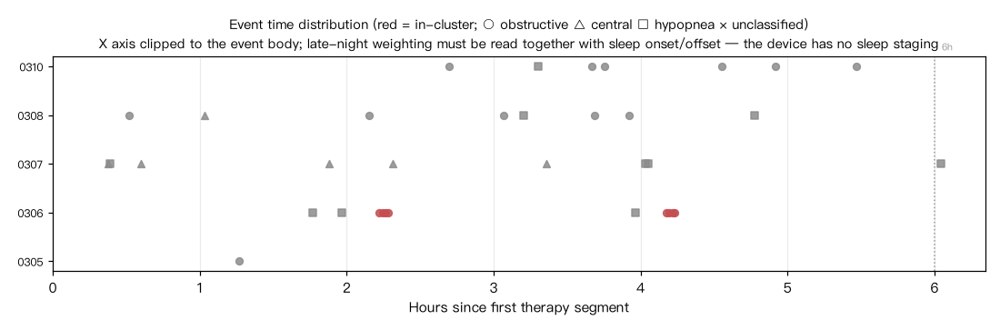

<div align="center">



# resmed-sd-monitor

**ResMed の SD カードを、検証可能な治療モニタリングレポートに。**

品質ゲート付きの効果推移 · 1 呼吸ごとの気流波形解析 · 誠実な「昇圧余地」の判定

[English](README.md) · [简体中文](README.zh.md) · **日本語**

[](https://github.com/CaufieldZ/resmed-sd-monitor/actions/workflows/ci.yml)
[](LICENSE)
[](pyproject.toml)
[](#免責事項)

[クイックスタート](#クイックスタート) · [得られるもの](#得られるもの) · [コマンド](#コマンド) · [出力の読み方](#出力の読み方) · [免責事項](#免責事項)

</div>

---

`resmed-sd-monitor` は、AirSense / AirCurve が SD カードに書き出している EDF ファイルを読み、
睡眠専門医が実際に読めるモニタリングレポートを生成します。処方変更ログで分割した効果推移、
1 呼吸ごとの気流解析、そして「これ以上昇圧する余地はあるか」への筋の通った答えです。

OSCAR のような *ビューア* に対する *アナリスト* です。すべてローカル・オフライン・再現可能。

> **医療機器ではありません。** 装置が記録した推定値をスクリーニングの手がかりと確認事項に
> 変えるだけで、睡眠時無呼吸の診断、圧力設定の決定、睡眠専門医の代替はできません。
> 全文は[免責事項](#免責事項)を参照してください。

## 仕組み



## 得られるもの

### 自分の処方変更履歴で分割された効果

小さな `tuning_log.json` に設定変更のたびに 1 行追記します。レポートは夜を期間ごとに分割し、
Mann–Whitney + Hodges–Lehmann で統計比較します。そして**ノイズを改善に見せかけることを拒否します**——
`p ≥ 0.05` は「明確な差は検出されず、等価性も証明されない」と表示され、「差がない」とは決して表示しません。

<p align="center"></p>

### 昇圧余地の答え — 2 つの交絡を明示的に処理

APAP の調整で最も難しい問いは「昇圧の余地はまだあるか」です。素朴な答えを誤らせる罠が
2 つあり、どちらも明示的に処理しています：

- **APAP はイベントに「反応して」昇圧する。** したがって「高圧帯でイベントが多い」は
  フィードバックループのこだまであり、圧力が無効な証拠ではありません。本ツールは圧力指標より
  前にフィードバック検証（イベント後の圧力変化 vs ランダム時点対照）を実行し、結果を表示します。
- **Ramp 通過ビン。** 開始圧から治療圧への上昇は低圧帯に数百呼吸分のサンプルを残します。
  それをフル稼働の高圧帯と比べると「ランプ vs 治療」を測ることになり、用量効果ではありません。
  曝露 3 % 未満のビンは除外されます。

残るのはクリーンな信号 — 圧力帯をまたいだ背景の気流制限（吸気平坦化指数）です：

<p align="center"></p>

### 1 呼吸ごとの気流波形層

25 Hz の気流チャネルから直接再構築します：呼吸ごとの吸気平坦化指数、イベントクラスタリング
（体位性/REM 関連の手がかり）、合成信号で較正した正弦フィットによる周期性呼吸の検出、
そしてイベントが**いつ**起きているかを一目で示すタイムライン：

<p align="center"></p>

### 品質ゲートは隠さず明示

治療記録 2 時間未満、チャネル欠損、Leak95 > 24 L/min の夜は除外され、**理由が印刷されます**。
SAD パルスオキシメトリのカバレッジが 70 % 未満なら「判定不能」と表示し、T90 を捏造しません。
レポートの各節には臨床医が必要とする注意書きが付きます（REI の分母は治療時間、EEG・体位・
呼吸努力チャネルなし、装置イベントはアルゴリズム推定）。

<details>
<summary><b>レポート抜粋</b>（クリックで展開）</summary>

```text
## 4b. Flow waveform layer (per-breath, last 5 nights)
- Feedback check: within 120 s after 36 events, pressure changed by median
  +0.67 cmH2O (56% rose above 0.5, 0% fell below -0.5); across 150 random-time
  controls, median +0.03, 3% rose. The device does pressurize reactively to
  events, so any "high pressure <-> many events" co-occurrence is that
  feedback's echo — not "pressure is ineffective".
- Periodic-breathing fit: 1/5 nights reach the threshold (corr²>=0.1); dominant
  period 46 s. Periodic ventilatory instability needs manual waveform review —
  the device has no EEG/effort channels; Cheyne-Stokes or TECSA cannot be
  declared from this.
- Pressure–flatness curve: therapy pressure range 11.0–13.5 cmH2O (5 bins,
  Ramp drive-by low bins excluded): FI median at 11.0 bin 0.087 → at 13.0 bin
  0.071; weighted slope -0.0087/cmH2O.
```

全文サンプル：[examples/demo/sample_report/](examples/demo/sample_report/sample_report.md)

</details>

## クイックスタート

SD カードは不要です——決定論的な合成データ（10 晩）をその場で生成します：

```bash
git clone https://github.com/CaufieldZ/resmed-sd-monitor
cd resmed-sd-monitor
pip install -e .[charts]

python examples/generate_demo_data.py                         # 合成 10 晩
python -m resmed_sd_monitor --data-dir examples/demo/data --report
```

自分のカードのコピーに対して実行する場合：

```bash
python -m resmed_sd_monitor --data-dir /path/to/sdcard --report
```

## コマンド

| コマンド | 得られるもの |
| --- | --- |
| `--report` | 完全なモニタリングレポート：品質ゲート、期間別推移＋統計、臨床確認事項、波形層、チャート（md + json スナップショット + png を `<data-dir>/reports/` に保存） |
| `--wave [N]` | 直近 N 晩の波形深掘り：平坦化指数、クラスタ、周期性呼吸、圧力—平坦化曲線、フィードバック検証 |
| `--pressure` | 記述的なイベント—圧力関連（旧来の粗いビュー） |
| `<YYYYMMDD>` | 単晩の詳細：各イベント発生時圧力付きのイベント一覧 |
| `--settings` | `STR.edf` から解析した現在の処方 |
| *（引数なし）* | 全晩のサマリ表 |
| `--csv` | 同じ表を CSV（21 列）で出力、表計算向け |
| `resmed-sd-monitor-maskoff` | マスクオフ時刻の監査：早期のマスク外しはイベント起因か |

オプション：`--data-dir`（または `$RSDM_DATA_DIR` / 旧 `$CPAP_DATA_DIR`）、`--lang en|zh|ja`。

## 出力の読み方

判読の規律**そのもの**が製品です。まず
[docs/interpretation-guide.md](docs/interpretation-guide.md) を読んでください。要約：

| 問い | 見る場所 | 罠 |
| --- | --- | --- |
| 治療は効いているか？ | 5 晩移動中央値、期間統計 | 単晩は 1–10 イベント/時で振れる——1 晩だけで判断しない |
| 昇圧は助けになるか？ | 圧力—平坦化曲線、上限滞在時間 | 「高圧帯でイベント多」は APAP 自身のフィードバックのこだま |
| 体位性 / REM 関連か？ | イベントのクラスタリング、時間帯分布 | 装置は体位も睡眠段階も記録しない——手がかりに留まる |
| 中枢性イベントの兆候は？ | 圧力/EPR 変更後の CAI 推移 | 昇圧後に CAI 上昇 = TECSA の警戒サインであり調整の細部ではない |
| マスクを早く外していないか？ | `resmed-sd-monitor-maskoff` | 短い単一セッション = 耐容性、断片的 = 覚醒起因 |

データ形式と落とし穴（STR.edf の手解析、EDF+ 注釈、複数セグメントの夜）：
[docs/data-format.md](docs/data-format.md)。
チューニングログのスキーマ：[docs/tuning-log.md](docs/tuning-log.md)。

## 言語

英語（ベース）、简体中文、日本語を同梱——出力・レポート・チャートラベルは `--lang` または
ロケール検出で切り替わります。日本語テーブルは機械支援翻訳のためネイティブレビューを歓迎します。
他の言語（de、fr、pt-BR など）の追加は小さなファイル 1 つ分です：
[docs/translating.md](docs/translating.md) を参照。

## インストール

Python ≥ 3.10。コア依存：`numpy`、`scipy`、`edfio`。チャート（matplotlib）はオプション——
なくてもレポートは生成されます（画像なし）。

```bash
pip install -e .            # コア
pip install -e .[charts]    # + matplotlib
pip install -e .[dev]       # + pytest、テストスイート用（106 テスト）
```

オフラインで動作、完全ローカル。データがマシンの外に出ることはありません。

## プロジェクト構成

```text
src/resmed_sd_monitor/
  monitor.py      解析エンジン + CLI（report / wave / pressure / detail / settings）
  maskoff.py      マスクオフ時刻の監査
  i18n/           en / zh / ja 文字列テーブル（整合性テスト付き）
examples/
  generate_demo_data.py   決定論的合成データ生成器
  demo/sample_report/     コミット済みサンプル出力（CI が鮮度を検証）
docs/             判読ガイド · データ形式 · チューニングログ · 翻訳ガイド
```

## コントリビュート

Issue と PR を歓迎します——特に：他機種での実機検証、言語テーブル、EDF のエッジケースに対する
より厳密なパーサ。医療安全に関わる文言の変更は真剣に扱います：出力における非診断の境界線は
意図的なもので、緩められることはありません。

```bash
pytest -q && ruff check src tests examples
```

## 免責事項

本ソフトウェアは情報提供と教育目的のみで提供されます。**医療機器ではなく**、いかなる規制当局の
審査も受けていません。出力は診断・治療勧告・処方ではありません。装置由来の指標（イベント指数、
圧力、パルスオキシメトリ）はアルゴリズム推定であり、既知の盲点（リーク、覚醒、睡眠段階の欠如）が
あります。治療の判断には必ず有資格の睡眠専門医を関与させてください。緊急時は直ちに救急医療を
受けてください。

ResMed、AirSense、AutoSet は ResMed Ltd. の商標です。本プロジェクトは独立した無関係の
ホビープロジェクトであり、それらの機器が SD カードに書き出すデータを読むだけです。

## ライセンス

[MIT](LICENSE)
