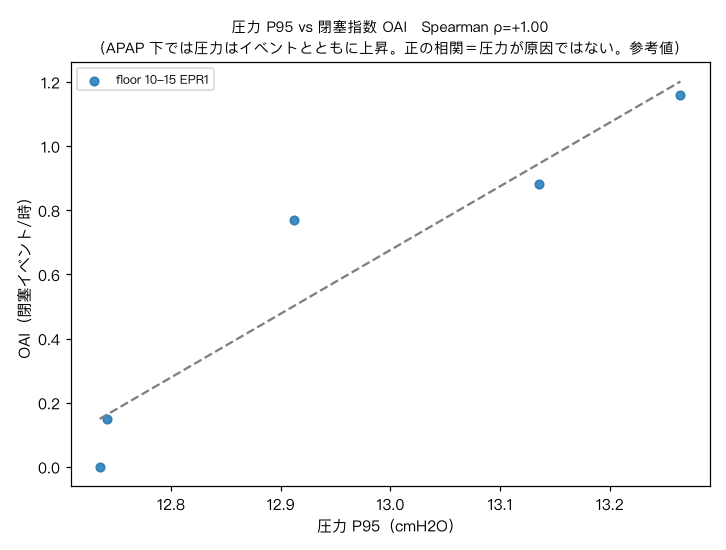
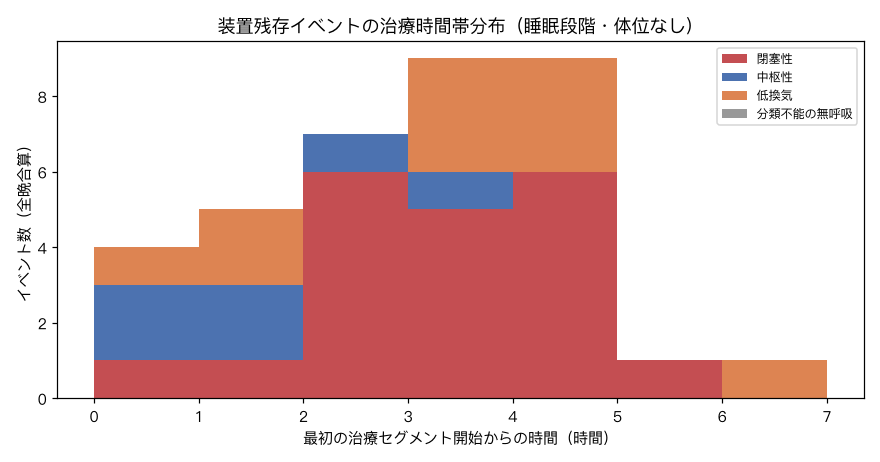
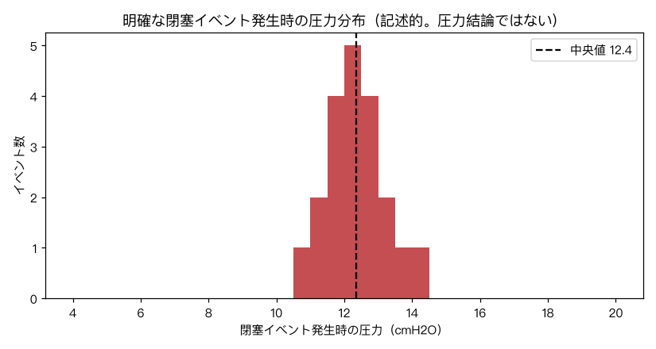
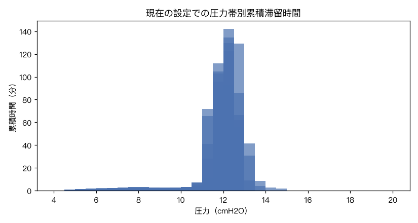

# PAP Therapy Monitoring Report (clinical decision support)  2026-09-18 17:20
> This report is based on ResMed flow/pressure-algorithm event estimates and therapy *usage* time — it is not PSG and does not constitute a diagnosis of sleep apnea, REM/positional OSA or TECSA. Have a sleep specialist review it together with symptoms, history, raw waveforms and, where needed, PSG / continuous oximetry.

**Device** ResMed AirSense 10 AutoSet (synthetic demo) (nasal)
**Recorded current settings** (floor 10-15 EPR1, since 20240305): pressure 10–15 cmH2O, EPR 1 (recorded only — not a prescription suggestion from this tool)

## 1. Data quality and scope of validity
- Covers 10 therapy dates (20240301–20240310); 9 nights enter trend analysis (record >=2 h, EVE/Leak present, Leak95 <=24 L/min).
- Nights with therapy record <4 h: 1; this means insufficient therapy exposure, not sleep duration and not a mask-off reason.
- Leak95 median 9.01 L/min. 24 L/min is a local screening line; a large leak may reduce the reliability of device event estimates rather than prove events absent.
- Excluded from trend analysis: Leak95 > 24 L/min: 1 nights; therapy record <2 h: 1 nights
- No EEG sleep staging, position, thoracoabdominal effort or manual waveform scoring; the device REI denominator is therapy time and must not be mapped onto PSG-AHI severity grades.

## 2. Current-segment clinical review cues: device trend near the common therapy target
Based on device therapy records after quality gating; not a formal diagnosis of sleep apnea.
- Median device residual event index over 5 analyzable nights: 1.2/h (therapy usage time as denominator, not PSG-AHI).
- 100% of analyzable nights >= 4 h (5/5).
- CAI median 0.0/h; the device record shows no sustained screen signal of CAI >= 5/h with dominance.
- Over 5 nights of continuous SAD oximetry: T90 median 0.4%, SpO2<88% minutes median 0.0.

**Suggested actions**
- Device trend near the common therapy target; if daytime sleepiness, morning headaches or marked arousals persist, clinical evaluation of other sleep/medical causes is still needed.

## 3. Segmented therapy trends (by tuning log; exploratory comparisons)
| Segment | Settings | Analyzable/total | Usage h mean | Device REI median[IQR] | OAI | CAI | UAI | Press P95 | FL95 |
|---|---|---|---|---|---|---|---|---|---|
| initial 9-14 EPR1 | 9–14 EPR1 | 4/4 | 6.6 | 1.1[0.5] | 0.8 | 0.0 | 0.0 | 11.7 | 0.14 |
| floor 10-15 EPR1 | 10–15 EPR1 | 5/6 | 6.7 | 1.2[0.3] | 0.8 | 0.0 | 0.0 | 12.9 | 0.13 |

**initial 9-14 EPR1 → floor 10-15 EPR1**: device REI median 1.1→1.2 (exploratory p=1.000, no clear difference detected; equivalence not proven); OAI 0.8→0.8 (p=0.556, no clear difference detected; equivalence not proven)

> Mann–Whitney comparisons describe independent-night distributions; no multiple-comparison correction, no control for position, REM, alcohol, nasal obstruction, illness fluctuation and other confounders; a statistical difference is not a clinical benefit caused by the parameter change.

## 4. Event–pressure association (descriptive; no pressure conclusions generated)
- Pressure at clearly-labelled obstructive events: median 12.2 cmH2O; therapy pressure median 12.1 cmH2O.
- 20 aligned obstructive events, 4 above the night's P90 (20%); high-pressure (>=P90) exposure occupies 10% of the record.
- High-segment/other event-rate ratio 2.25 (exposure-corrected by pressure sample). **This ratio must not be read as "more pressure does not help"**: APAP raises pressure after events; high-segment dwell is itself event-triggered (feedback check in section 4b) — the co-occurrence is an echo, not causation.
- Cross-night Spearman ρ(pressure P95, OAI)=+1.00 (n=5); APAP has the reverse causality of post-event pressurization — no causal reading.
- **event-pressure co-occurrence only; no cause can be inferred**: 20% of 20 clearly-labelled obstructive events occurred above the night's P90 (that pressure band occupies 10% of the therapy record); exposure-corrected high/other event-rate ratio 2.25. APAP raises pressure reactively after events — dwelling in the high band is naturally triggered by events; a high event rate is the echo of that feedback, not "pressure is ineffective". Without position, sleep staging and manual waveform review, positional/REM relevance or complexity cannot be judged either.
- Distribution within the therapy record (36 events): first 39% / middle 47% / last 14%; uneven distribution within the therapy record; without position and sleep staging, no attribution

## 4b. Flow waveform layer (per-breath, last 5 nights)
> Breathing is rebuilt breath-by-breath from BRP 25 Hz flow (inspiratory-peak detection + inspiratory flattening index). The FI is a relative measure against each night's own baseline, not a literature absolute; device flow is not PSG nasal pressure — no EEG arousals, no position, no thoracoabdominal effort. Every item below is a relative device-trend cue.
- Feedback check: within 120 s after 36 events, pressure changed by median +0.67 cmH2O (56% rose above 0.5, 0% fell below -0.5); across 150 random-time controls, median +0.03, 3% rose. The device does pressurize reactively to events, so any "high pressure <-> many events" co-occurrence is that feedback's echo — not "pressure is ineffective".
- Per-breath flattening index median 0.076 (5 nights; a relative measure against each night's own baseline, never an absolute verdict).
- Event clustering: 2 clusters across 5 nights (>=3 events with adjacent gaps <=2 min); the in-cluster share of all events has median 0%. Clustering is the classic cue for positional/REM-related OSA, but the device records neither position nor sleep stage — no attribution from this alone.
- Periodic-breathing fit: 1/5 nights reach the threshold (corr²>=0.1); dominant period 46 s, of which short-period (<40 s): 0 nights. Periodic ventilatory instability needs manual waveform review — the device has no EEG/effort channels; Cheyne-Stokes or TECSA cannot be declared from this.
- Pressure–flatness curve: therapy pressure range 11.0–13.5 cmH2O (5 bins, Ramp drive-by low bins excluded): FI median at 11.0 bin 0.085 → at 13.0 bin 0.074; weighted slope -0.0067/cmH2O.
- Limited breaths increase as pressure rises (negative slope): mostly reverse causation from APAP reactive pressurization (events trigger the rise; those breaths are still recovering) — never read as "pressure is harmful".
- Pressure at obstructive events: median 12.4 cmH2O; share >=14 cmH2O: 5%, >=15 cmH2O: 0%.
- Split by delivered pressure: low segment (<12.8 cmH2O, P90) 0.1 events per 100 breaths, high segment (>=12.8) 0.2 (23345 low / 1045 high breaths). ⚠ This ratio is **not** evidence of "whether pressure works": the device raises pressure after events (feedback check above), high-segment dwell is itself triggered by events — "more events in the high segment" is the echo of that feedback. It only shows the device does work up there.
- Delivered pressure: median 11.2, P90 12.8, peak 14.8 cmH2O; 0.1% of inspiratory breaths dwell within 0.5 of the ceiling.
- Peak touches the set ceiling 15.0 cmH2O but only for 0.1% of time (scattered transient touches, no sustained dwell) — occasional touching is not a limitation; raising the ceiling alone has small expected benefit.

## 5. Ventilation, flow limitation and oxygenation (monitoring metrics)
- FlowLim95 0.13, snore P95 0.03; useful for trend review on the same device/settings — alone they cannot diagnose airway collapse.
- Resp rate median 13.2 /min · tidal volume median 0.46 L · minute ventilation median 6.0 L/min. Device estimates are affected by leak and wakefulness.
- Nightly minimum SpO2 median 89.4% (mean 95.9%) (sources: SAD). Continuous SAD feeds the section-2 hypoxia screen; nights without sufficient SAD coverage are excluded rather than estimated.

## 6. Last 7 therapy dates
| Date | Record h | Device REI | OAI | CAI | UAI | Press P95 | Leak95 | SpO2 min |
|---|---|---|---|---|---|---|---|---|
| 20240304 | 6.5 | 0.9 | 0.6 | 0.0 | 0.0 | 11.7 | 8.99 | 89.4 |
| 20240305 | 6.7 | 0.1 | 0.1 | 0.0 | 0.0 | 12.7 | 9.01 | 90.1 |
| 20240306 | 6.9 | 1.6 | 1.2 | 0.0 | 0.0 | 13.3 | 9.02 | 84.0 |
| 20240307 | 6.6 | 1.4 | 0.0 | 0.8 | 0.0 | 12.7 | 9.02 | 94.4 |
| 20240308 | 6.5 | 1.2 | 0.8 | 0.2 | 0.0 | 12.9 | 9.02 | 89.4 |
| 20240309 | 1.6 | 0.6 | 0.6 | 0.0 | 0.0 | 12.3 | 33.94 | 89.3 |
| 20240310 | 6.8 | 1.0 | 0.9 | 0.0 | 0.0 | 13.1 | 8.99 | 89.4 |

## Charts

## Handoff notes
- For emergency symptoms — chest pain, marked breathlessness, altered consciousness, hypoxia while awake — seek emergency care; this report is not an emergency-triage instrument.
- Parameter changes are medical decisions. Hand this report, symptom changes, medications/comorbidities and the raw SD-card data to the sleep specialist or prescribing team for review.
